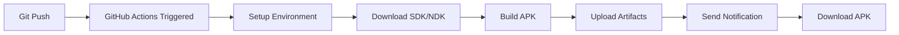

# ✅ GitHub Actions - Setup Complete!

## 🎉 Opsi 2 Sudah Siap!

GitHub Actions untuk automatic cloud build sudah dikonfigurasi lengkap!

---

## 📁 Yang Sudah Dibuat

### 1. **GitHub Actions Workflows** (`.github/workflows/`)

#### `android-build.yml` ⭐
- **Auto-build** debug APK setiap push
- **Trigger:** Push to main/master/develop, PR, Manual
- **Output:** Debug APK di Artifacts (30 days)
- **Duration:** 15-20 min (first), 8-15 min (cached)

#### `android-release.yml` 🎯
- **Auto-build** release APK untuk distribusi
- **Trigger:** Push version tag (v1.0.0), Manual
- **Output:** Release APK + GitHub Release
- **Duration:** 20-25 min

#### `test-build.yml` 🔍
- **Quick validation** tanpa build penuh
- **Trigger:** Pull requests, Manual
- **Output:** Validation report
- **Duration:** 3-5 min

### 2. **Setup Scripts**

#### `setup_github.bat` (Windows)
- Auto-initialize git repository
- Create .gitignore (protect credentials!)
- Commit all files
- Push to GitHub
- Interactive prompts

#### `setup_github.sh` (Linux/Mac/WSL)
- Same functionality untuk Unix-based systems
- Shell script dengan error handling

### 3. **Documentation Lengkap**

#### `GITHUB_ACTIONS_SETUP.md` ⭐ MAIN GUIDE
- **Complete setup guide** from scratch
- Step-by-step instructions
- Download APK methods (web, CLI, API)
- Create release guide
- Configuration options
- Troubleshooting lengkap
- Cost & limits info

#### `QUICK_BUILD_OPTIONS.md`
- **Comparison** GitHub Actions vs WSL
- **Recommendation** berdasarkan use case
- Quick links ke semua dokumentasi
- Decision matrix

#### `.github/workflows/README.md`
- Penjelasan setiap workflow
- How to use
- Configuration examples
- Troubleshooting workflow-specific

---

## 🚀 Quick Start (5 Menit!)

### Step 1: Create GitHub Repository

1. Go to https://github.com/new
2. Repository name: `AutoLiveBio`
3. Public (for free unlimited builds)
4. **Don't add** README or .gitignore
5. Click **Create repository**

### Step 2: Run Setup Script

**Windows:**
```cmd
cd D:\A-YT\YT\AutoLiveBio
setup_github.bat
```

**Linux/Mac/WSL:**
```bash
cd /path/to/AutoLiveBio
chmod +x setup_github.sh
./setup_github.sh
```

### Step 3: Monitor Build

1. Go to your repository on GitHub
2. Click **"Actions"** tab
3. See **"Build Android APK"** running
4. Wait ~15-20 minutes
5. Download APK from **"Artifacts"**

### Step 4: Install on Android

1. Download APK ZIP from Artifacts
2. Extract ZIP
3. Transfer APK to phone
4. Install (allow "unknown sources")
5. Done! 🎉

---

## 📊 What Happens After Push



**Timeline:**
- 0-2 min: Setup environment
- 2-8 min: Download SDK/NDK (first time, cached later)
- 8-18 min: Build APK
- 18-20 min: Upload artifacts
- **Total: ~15-20 min** (first build)
- **Total: ~8-15 min** (subsequent builds with cache)

---

## 🎯 Use Cases

### 1. **Continuous Integration (CI)**

Every time you push code:
```bash
git add .
git commit -m "Fix bug in authentication"
git push
```

→ GitHub Actions automatically builds APK  
→ Team can download and test  
→ No local build needed  

### 2. **Release Management**

When ready to release:
```bash
git tag v1.0.0
git push origin v1.0.0
```

→ GitHub Actions builds release APK  
→ Creates GitHub Release  
→ Users can download from Release page  

### 3. **Pull Request Testing**

When someone creates PR:
```bash
# Create PR on GitHub
```

→ GitHub Actions runs `test-build.yml`  
→ Validates code (3-5 min)  
→ Comments on PR with results  
→ Optionally builds full APK  

### 4. **Manual Builds**

Need APK without pushing code:
```
GitHub → Actions → Build Android APK → Run workflow
```

→ Select branch  
→ Click "Run workflow"  
→ Wait for build  
→ Download from Artifacts  

---

## 📥 Download Methods

### Method 1: Web (Easiest)
1. Go to repo **Actions** tab
2. Click completed workflow run
3. Scroll to **Artifacts**
4. Click **AndroStream-Debug-APK**
5. Extract ZIP → APK inside

### Method 2: GitHub CLI
```bash
gh auth login
gh run list --workflow=android-build.yml
gh run download --name AndroStream-Debug-APK
```

### Method 3: From Releases
1. Go to repo **Releases** tab
2. Click version (e.g., v1.0.0)
3. Download APK from **Assets**

### Method 4: Direct Link
```
https://github.com/username/AutoLiveBio/releases/download/v1.0.0/AndroStream-1.0.0-release.apk
```

---

## ⚙️ Customization

### Change Build Triggers

Edit `.github/workflows/android-build.yml`:

```yaml
on:
  push:
    branches: [ main, develop, feature/* ]  # Add branches
    paths:
      - 'androstream/**'  # Only trigger on changes
```

### Add Notifications

Slack notification:
```yaml
- name: Notify Slack
  if: always()
  uses: 8398a7/action-slack@v3
  with:
    status: ${{ job.status }}
    webhook_url: ${{ secrets.SLACK_WEBHOOK }}
```

Discord notification:
```yaml
- name: Notify Discord
  uses: sarisia/actions-status-discord@v1
  with:
    webhook: ${{ secrets.DISCORD_WEBHOOK }}
```

### Sign APK Automatically

Add secrets in repo settings:
- `KEYSTORE_FILE` (base64)
- `KEYSTORE_PASSWORD`
- `KEY_ALIAS`
- `KEY_PASSWORD`

Add step in workflow:
```yaml
- name: Sign APK
  run: |
    echo "${{ secrets.KEYSTORE_FILE }}" | base64 -d > keystore.jks
    jarsigner -keystore keystore.jks ...
```

---

## 🔧 Troubleshooting

### Build Failed - Check Logs

1. Actions tab → Failed run
2. Click job name
3. Expand failed step
4. Copy error message
5. Search in `GITHUB_ACTIONS_SETUP.md#troubleshooting`

### Common Errors

**"No space left on device"**
```yaml
- name: Free space
  run: sudo rm -rf /usr/share/dotnet
```

**"Timeout"**
```yaml
timeout-minutes: 180  # Increase from 120
```

**"Cache corrupted"**
- Actions → Caches → Delete all
- Retry build

**"Cannot download artifact"**
- Check retention period (30 days default)
- Use Release workflow instead

---

## 💰 Cost & Limits

### Free Tier:
- **Public repos:** ✅ Unlimited minutes
- **Private repos:** 2,000 min/month
- **Storage:** 500MB artifacts

### Usage:
- Debug build: ~20 minutes
- Release build: ~25 minutes
- Test: ~3 minutes

**100 builds/month = 2,000 minutes**

**Tip:** Use public repo = unlimited! 🚀

---

## 📚 All Documentation Files

### Setup & Usage:
1. **GITHUB_ACTIONS_SETUP.md** ⭐ Main guide
2. **QUICK_BUILD_OPTIONS.md** - Choose your method
3. **setup_github.bat** / **.sh** - Setup scripts

### Workflows:
4. **.github/workflows/README.md** - Workflow details
5. **.github/workflows/android-build.yml** - Auto build
6. **.github/workflows/android-release.yml** - Release build
7. **.github/workflows/test-build.yml** - Quick test

### Android App:
8. **androstream/README.md** - App documentation
9. **androstream/PANDUAN_INDONESIA.md** - Panduan lengkap
10. **androstream/QUICK_START.txt** - Quick reference

---

## ✅ Verification Checklist

Pastikan semua ini ada:

**Files:**
- [ ] `.github/workflows/android-build.yml`
- [ ] `.github/workflows/android-release.yml`
- [ ] `.github/workflows/test-build.yml`
- [ ] `.github/workflows/README.md`
- [ ] `setup_github.bat`
- [ ] `setup_github.sh`
- [ ] `GITHUB_ACTIONS_SETUP.md`
- [ ] `QUICK_BUILD_OPTIONS.md`
- [ ] `.gitignore` (with client_secret*.json)

**Ready to go?**
- [ ] Run `setup_github.bat` or `.sh`
- [ ] Push to GitHub
- [ ] Check Actions tab
- [ ] Wait for build
- [ ] Download APK
- [ ] Test on Android
- [ ] 🎉 Success!

---

## 🎯 Next Steps

### After First Build:

1. **Test APK** on real Android device
2. **Create first release:**
   ```bash
   git tag v1.0.0
   git push origin v1.0.0
   ```
3. **Share APK** with testers
4. **Setup signing** for production
5. **Configure notifications** (optional)

### For Development:

```bash
# Edit code
edit androstream/main.py

# Commit & push
git add .
git commit -m "Update feature"
git push

# Wait for auto-build (~15 min)
# Download new APK
# Test and repeat
```

---

## 🆚 GitHub Actions vs WSL

| Feature | GitHub Actions | WSL |
|---------|---------------|-----|
| Setup | 5 min | 30-60 min |
| Build Time (first) | 15-20 min | 30-60 min |
| Build Time (next) | 8-15 min | 2-5 min |
| Auto Build | ✅ Yes | ❌ No |
| Internet | Upload/Download | First time only |
| Storage | 500MB cloud | 10GB+ local |
| Cost | Free (public) | Free |
| **Best For** | Team, CI/CD | Solo, Frequent builds |

**Recommendation:**
- **90% users:** GitHub Actions ⭐
- **Heavy devs:** Both (GitHub for releases, WSL for dev)

---

## 🎓 Learn More

- **GitHub Actions:** https://docs.github.com/en/actions
- **Buildozer:** https://buildozer.readthedocs.io/
- **Kivy:** https://kivy.org/doc/stable/
- **YouTube API:** https://developers.google.com/youtube/v3

---

## 🎉 Summary

### What You Got:

✅ **3 GitHub Actions workflows** for automatic building  
✅ **Setup scripts** for easy initialization  
✅ **Complete documentation** in English & Indonesian  
✅ **Examples & troubleshooting** for common issues  
✅ **Free cloud builds** (public repo = unlimited!)  

### What To Do:

1. Run `setup_github.bat` or `.sh`
2. Push to GitHub
3. Wait ~15-20 minutes
4. Download APK
5. Install on Android
6. **Done!** 🚀

---

**Selamat! GitHub Actions sudah siap! 🎉**

**No WSL, no hassle - just push and download APK! 🚀**

---

## 📞 Support

Need help?
- Read: `GITHUB_ACTIONS_SETUP.md`
- Check: `.github/workflows/README.md`
- Look: Troubleshooting sections
- Ask: GitHub Issues

**Happy building with GitHub Actions! 🤖**
